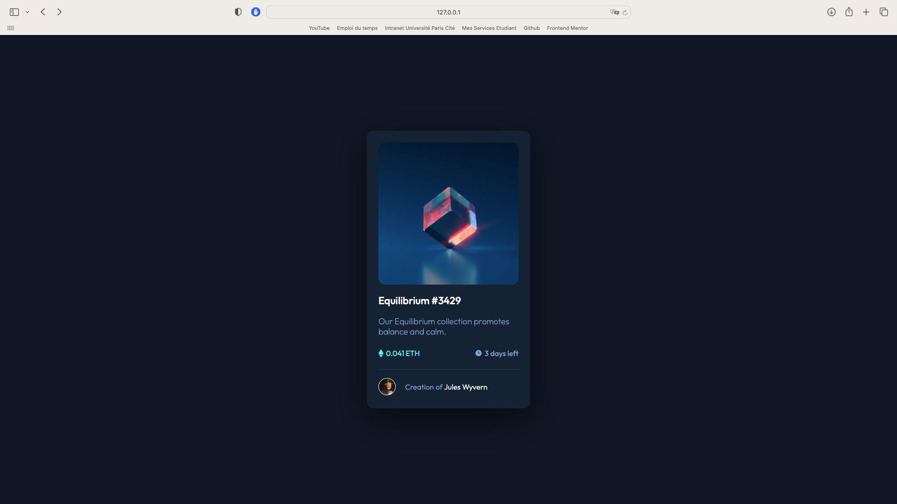

# Frontend Mentor - NFT preview card component

This is a solution to the [NFT preview card on Frontend Mentor](https://www.frontendmentor.io/challenges/nft-preview-card-component-SbdUL_w0U/hub). Frontend Mentor challenges help you improve your coding skills by building realistic projects. 

## Table of contents

- [Overview](#overview)
  - [The challenge](#the-challenge)
  - [Screenshot](#screenshot)
  - [Links](#links)
- [My process](#my-process)
  - [Built with](#built-with)
  - [What I learned](#what-i-learned)
  - [Continued development](#continued-development)
  - [Useful resources](#useful-resources)
- [Author](#author)

## Overview

### The challenge

Users should be able to:

- See hover states for interactive elements

### Screenshot



### Links

- Live Site URL: [Live Site URL](https://sprightly-khapse-cdf3c0.netlify.app)

## My process

### Built with

- Semantic HTML5 markup
- CSS custom properties
- Flexbox

### What I learned

I learn how to put an image in another image and create his own filter. I also learn how to use opacity in CSS and try some new things with centering content in a box.

```html
<a href="#" target="_blank" id="imageLink">
  <div id="filter"></div>
</a>
```
```css
#filter{
    opacity: 0;
    display: flex;
    align-items: center;
    justify-content: center;
    height: 100%;
    width: 100%;
    background-color: hsla(178, 100%, 50%, 0.5);
    border-radius: 15px;
}

#filter:hover{
    opacity: 1;
}
```

### Continued development

I want to start to learn JavaScript (Because i don't know how to use Javascript and his libraries) and learn how to use grid. I want to learn how to use perfectly box shadow too.

### Useful resources

- [Pierre Giraud](https://www.pierre-giraud.com/html-css-apprendre-coder-cours/) - The website's in french but you can also learn how to use JavaScript. This is with that than i learn how to use HTML and CSS to make websites.

## Author

- Github - [Isekku](https://github.com/Isekku)
- Frontend Mentor - [@Isekku](https://www.frontendmentor.io/profile/Isekku)
- Twitter - [@kesusama](https://www.twitter.com/kesusama)
